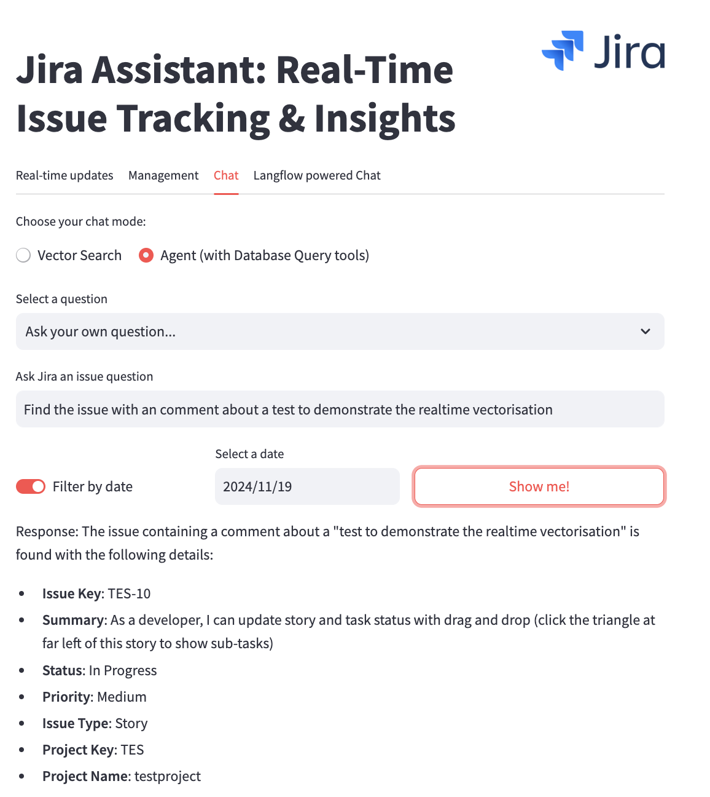
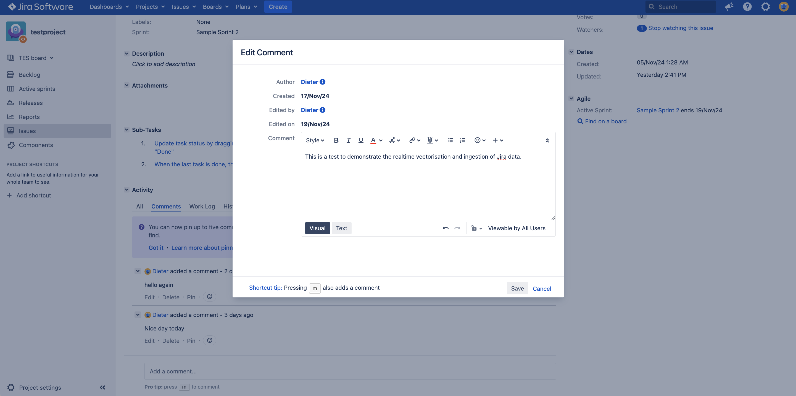
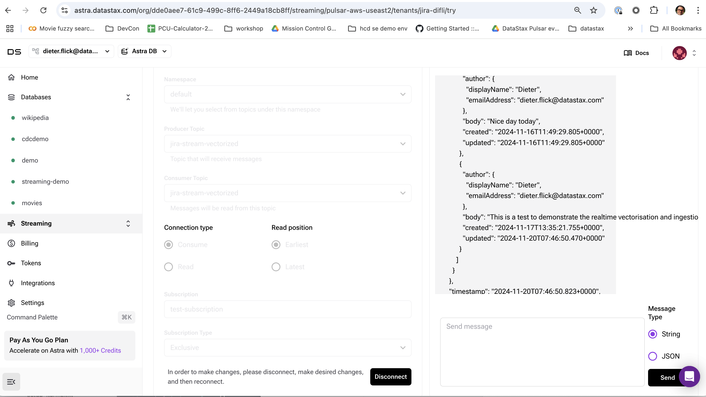
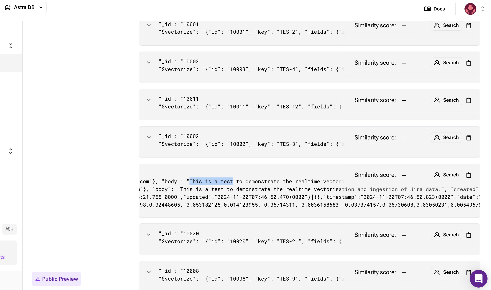
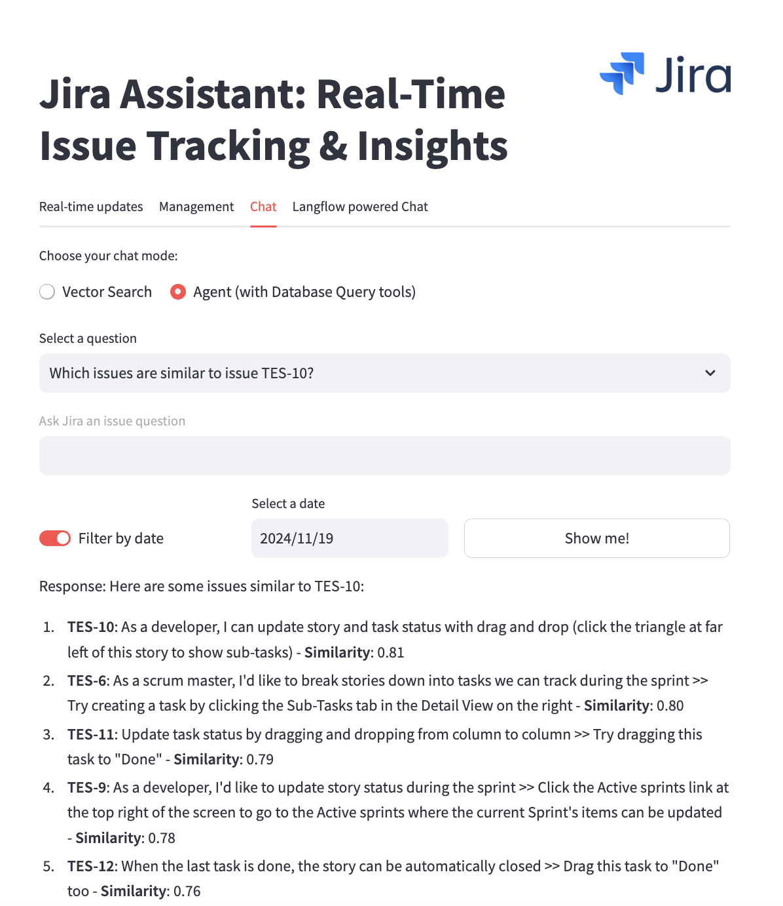
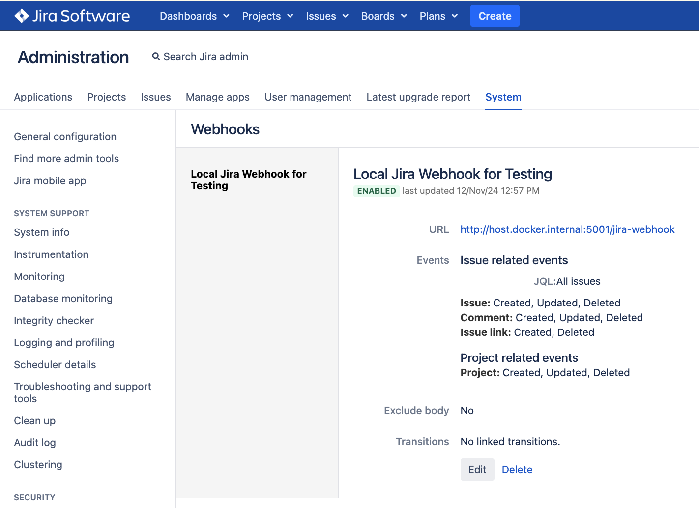

# Jira Assistant: Real-Time Issue Tracking & Insights

This project demonstrates a **real-time generative AI demo** built for **Jira Assistant** capabilities, enabling **Real-Time Issue Tracking & Insights** using **Astra DB**, **Astra Streaming**, **Pulsar Functions**, and a **Streamlit** application. The architecture leverages real-time data ingestion from Jira into Astra DB, enriching the data with generative AI capabilities and providing an interface for insights and query processing.

 

## Table of Contents

1. [Overview](#overview)
2. [Features](#features)
3. [Architecture](#architecture)
4. [Prerequisites](#prerequisites)
5. [Setup Instructions](#setup-instructions)
   - [Step 1: Clone This Repo](#step-1-clone-this-repo)
   - [Step 2: Create a Virtual Python Environment](#step-2-create-a-virtual-python-environment)
   - [Step 3: Install Requirements](#step-3-install-requirements)
   - [Step 4: Install Jira on Docker](#step-4-install-jira-on-docker)
   - [Step 5: Configure Astra Streaming and DB](#step-5-configure-astra-streaming-and-db)
   - [Step 6: Run Initial Synchronization](#step-6-run-initial-synchronization)
   - [Step 7: Run the Jira Webhook Script](#step-7-run-the-jira-webhook-script)
   - [Step 8: Configure Streamlit Application](#step-8-configure-streamlit-application)
   - [Step 9: Run the Application](#step-9-run-the-application)
6. [Running the Application](#running-the-application)

---

## Overview

The **Jira Assistant** provides a seamless way to ingest Jira events into Astra DB via Astra Streaming and Pulsar Functions. Enriched data is stored in a vector-enabled Astra DB collection to support vector-based queries and generative AI capabilities. The **Streamlit application** serves as a interface for tracking real-time Jira updates and querying the data, with support for **natural language queries** via an AI-powered agent.

### What Makes This a Real-Time Generative AI Demo?

- **Real-Time Updates**:
  - Jira webhook updates trigger immediate ingestion and enrichment pipelines.
  - Data is available for querying in real time.
- **AI-Powered Insights**:
  - Uses OpenAI to generate summaries and metadata for Jira issues.
  - Supports natural language queries powered by a **Jira Assistant agent** that leverages tools for semantic search and database queries.
- **Interactive Interface**:
  - A dashboard with options for vector search, AI-driven insights, and hybrid querying.

This project is inspired by:
- [Wikipedia Pulsar Cassandra Demo](https://github.com/michelderu/wikipedia-pulsar-cassandra)
- [Wikipedia Langflow Streamlit Demo](https://github.com/michelderu/wikipedia-langflow-streamlit)

---

## Features

- **Real-Time Jira Updates**:
  - Ingest updates from Jira into Astra DB in real time via Pulsar.
  - Automatic data updates in the user interface.
  - 

- **Data Enrichment with AI**:
  - Enrich Jira data using Pulsar Functions with vectorization and metadata extraction.
  - Summarize and categorize issues using OpenAI.
  - 
  - 

- **Generative AI-Powered Queries**:
  - Vector search or agent-based chat for natural language queries.
  - Real-time recommendations and searches for related issues.
- **Interactive Dashboard**:
  - Query Jira data, visualize real-time updates, and interact with insights via Streamlit.
- **Scalable Architecture**:
  - Built on Astra DB and Astra Streaming for scalability and reliability.

---

## Architecture

The architecture includes the following components:

1. **Initial Sync Script**:
   - [`jira-to-pulsar-sync.py`](jira-pulsar-integration/jira-to-pulsar-sync.py): Loads all existing Jira issues into Astra Streaming and subsequently into Astra DB.

2. **Jira Webhook**:
   - Triggers on Jira issue updates and sends events to Astra Streaming via [`jira-pulsar-webhook.py`](jira-pulsar-integration/jira-pulsar-webhook.py).

3. **Pulsar Functions**:
   - [`vectorize.py`](pulsar-functions/vectorize-function/vectorize/src/vectorize.py): Enriches Jira events by vectorizing and categorizing the data.
   - [`ingest-to-astra.py`](pulsar-functions/ingest-to-astra-function/ingest-to-astra/src/ingest-to-astra.py): Saves enriched data into Astra DB.

4. **Streamlit Application**:
   - [`app.py`](jira-streamlit/app.py): Provides a user interface for querying data and tracking Jira updates.
   - **Example Query**: "Which issues are similar to TES-10?"
     


5. **Agent Integration**:
   - **Jira Assistant agent** provides enhanced capabilities for semantic search and json data queries powered by astrapy ([repo here](https://github.com/difli/jira-astra-agent)).

---

## Running the Application

Once the application is running, explore real-time Jira updates and advanced queries:

- **Update a Jira Issue**
  

- **Interactive Agent Chat**: "Find the issue with a comment about a test to demonstrate real-time vectorization."
  

---

## Prerequisites

Before proceeding, ensure the following:

1. **Docker and Docker Compose** are installed.
2. [**Astra DB** and **Astra Streaming**](https://astra.datastax.com) accounts are created.
3. **Python** is installed.
4. [**OpenAI API Key**](https://platform.openai.com/api-keys) for AI-powered features.

---

Here’s a detailed version of the **Setup Instructions** section, including all the necessary information to help users properly configure and run the project.

---

## Setup Instructions


### Step 1: Clone This Repo

1. **Clone the repository to your local machine**:
   ```bash
   git clone https://github.com/difli/jira-astra-demo.git
   cd jira-astra-demo
   ```

---

### Step 2: Create a Virtual Python Environment

1. Set up a virtual environment:
   ```bash
   python -m venv venv
   source venv/bin/activate  # On Windows: venv\Scripts\activate
   ```

---

### Step 3: Install Requirements

1. Install dependencies:
   ```bash
   pip install -r requirements.txt
   ```

---

### Step 4: Install Jira on Docker

1. **Set up Jira using Docker**:
   - Use the provided [`docker-compose.yml`](jira-docker-setup/docker-compose.yml) file to set up Jira and Postgres:
     ```bash
     docker-compose up -d
     ```

2. **Access Jira**:
   - Open Jira in your browser at `http://localhost:8080` and complete the initial setup:
     - Choose the trial license key when prompted.
     - Set up the default **Test Project (`TES`)** that comes with Jira.

3. **Enable Jira Webhooks**:
   - Log in to the Jira admin panel.
   - Navigate to **System Settings** > **Webhooks** and create a webhook:
     - **URL**: Point to the endpoint where the `jira-pulsar-webhook.py` script is running (e.g., `http://localhost:5000/webhook`).
     - **Event Triggers**: Select the events you want to capture (e.g., "Issue Created," "Issue Updated").
     - If using Docker, configure Jira to use `host.docker.internal` to access your local machine.

     

---

### Step 5: Configure Astra Streaming and DB

#### **1. Create Astra DB Collection**:
1. Log in to your **Astra DB** account and create a new vector-enabled collection.
2. Enable **vectorization** for the collection:
   - Use OpenAI as the vectorization provider.
   - Use the small embedding model for efficiency and scalability.
3. Recommended collection name: `jira_data`.

#### **2. Set Up Astra Streaming**:
Before setting up Astra Streaming, ensure you have [**Apache Pulsar 3.3.2**](https://archive.apache.org/dist/pulsar/pulsar-3.3.2/apache-pulsar-3.3.2-bin.tar.gz) installed and configured in the root of this project.

1. **Download `client.conf`**:
   - Log in to your Astra Streaming dashboard and download the `client.conf` file.
   - Place the file in the `conf` directory of your local `apache-pulsar-3.3.2` installation.

2. **Create Topics**:
   - Navigate to the `apache-pulsar-3.3.2` directory and run the following commands:
     ```bash
     cd apache-pulsar-3.3.2
     bin/pulsar-admin topics create "persistent://<tenant>/<namespace>/jira-stream"
     bin/pulsar-admin topics create "persistent://<tenant>/<namespace>/jira-stream-vectorized"
     bin/pulsar-admin topics create "persistent://<tenant>/<namespace>/jira-stream-log"
     ```
     Replace `<tenant>` and `<namespace>` with your Astra Streaming tenant and namespace details.

     These topics serve the following purposes:
     - **`jira-stream`**: Stores raw Jira updates received from webhooks.
     - **`jira-stream-vectorized`**: Contains enriched Jira data after vectorization.
     - **`jira-stream-log`**: Logs Pulsar Function executions for debugging and monitoring.

3. **Deploy Pulsar Functions**:
   - Configure the `create-config.yaml` file for each Pulsar Function.
   - Deploy the functions using the following commands:
     ```bash
     cd apache-pulsar-3.3.2
     bin/pulsar-admin functions create --function-config-file=../pulsar-functions/vectorize-function/create-config.yaml
     bin/pulsar-admin functions create --function-config-file=../pulsar-functions/ingest-to-astra-function/create-config.yaml
     ```

#### **3. Pulsar Function Details**:
- **`vectorize.py`**:
  - **Purpose**: Reads raw Jira data from `jira-stream`, enriches it by vectorizing and categorizing the data.
  - **Output**: Publishes enriched data to `jira-stream-vectorized`.

- **`ingest-to-astra.py`**:
  - **Purpose**: Reads enriched data from `jira-stream-vectorized` and stores it in the **Astra DB vector-enabled collection**.
  - **Output**: Writes to the `jira_data` collection in Astra DB.

---

### Step 6: Run Initial Synchronization

1. **Set up `.env` file for `jira-to-pulsar-sync.py`**:
- Copy [`env.example`](jira-pulsar-integration/.env.example) to `.env` and configure it.

2. **Run `jira-to-pulsar-sync.py`**:
   - This script synchronizes all existing Jira issues into Astra DB:
     ```bash
     cd jira-pulsar-integration
     python jira-pulsar-sync.py
     ```
     
3. **Verify synchronization**:
   - Confirm that the data has been ingested into the `jira_data` collection.

---

### Step 7: Run the Jira Webhook Script

1. **Run the webhook script**:
   - Start the script to listen for incoming Jira events:
     ```bash
     cd jira-pulsar-integration
     python jira-pulsar-webhook.py
     ```

2. **Test the webhook**:
   - Update an issue in the Jira `TES` project to trigger the webhook.
   - Verify that:
     - Events are sent to the Pulsar topic `jira-stream`.
     - The vectorization and ingestion processes are working correctly.

---

### Step 8: Configure Streamlit Application

1. **Set up `secrets.toml`**:
   - Copy the [`secrets.toml.example`](jira-streamlit/.streamlit/secrets.toml.example) file to `secrets.toml` and update it with your credentials.
---

### Step 9: Run the Application

1. **Start the Streamlit application**:
   - Launch the app:
     ```bash
     cd jira-streamlit
     streamlit run app.py
     ```

2. **Access the dashboard**:
   - Open the app in your browser at `http://localhost:8501`.

3. **Explore the functionality**:
   - Monitor real-time Jira updates.
   - Query Jira issues using vector search or the **Jira Assistant agent**.

---
